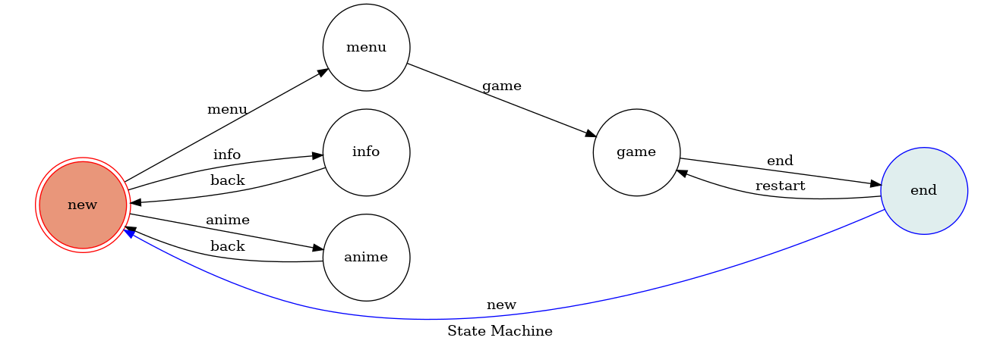

# TOC Project 2019

A Facebook messenger bot based on a finite state machine

## Setup

### Prerequisite
* Python 3
* Facebook Page and App
* HTTPS Server

#### Install Dependency
```sh
pip3 install -r requirements.txt
```

* pygraphviz (For visualizing Finite State Machine)
    * [Setup pygraphviz on Ubuntu](http://www.jianshu.com/p/a3da7ecc5303)

#### Secret Data

`VERIFY_TOKEN` and `ACCESS_TOKEN` **MUST** be set to proper values.
Otherwise, you might not be able to run your code.

#### Run the sever

```sh
python3 app.py
```

## Finite State Machine


## Usage

* Get started
	* Input: "menu"
		* Action: Display game menu

	* Input: "info"
		* Action: Display infomaiton of this app
		
	* Input: "anime"
		* Action: Get a random anime


## Reference
[TOC-Project-2017](https://github.com/Lee-W/TOC-Project-2017) ❤️ [@Lee-W](https://github.com/Lee-W)
